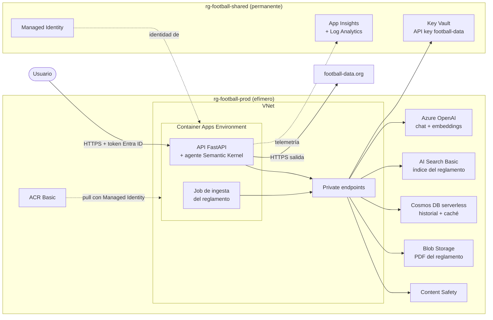
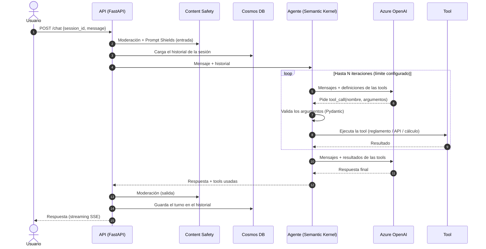
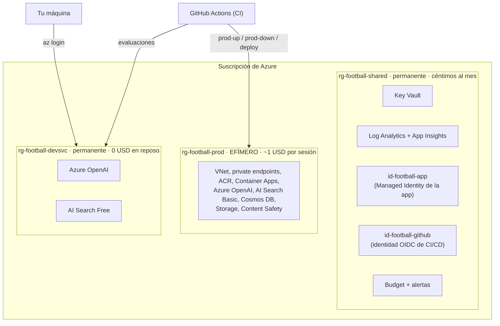
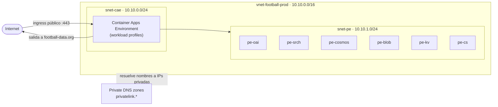
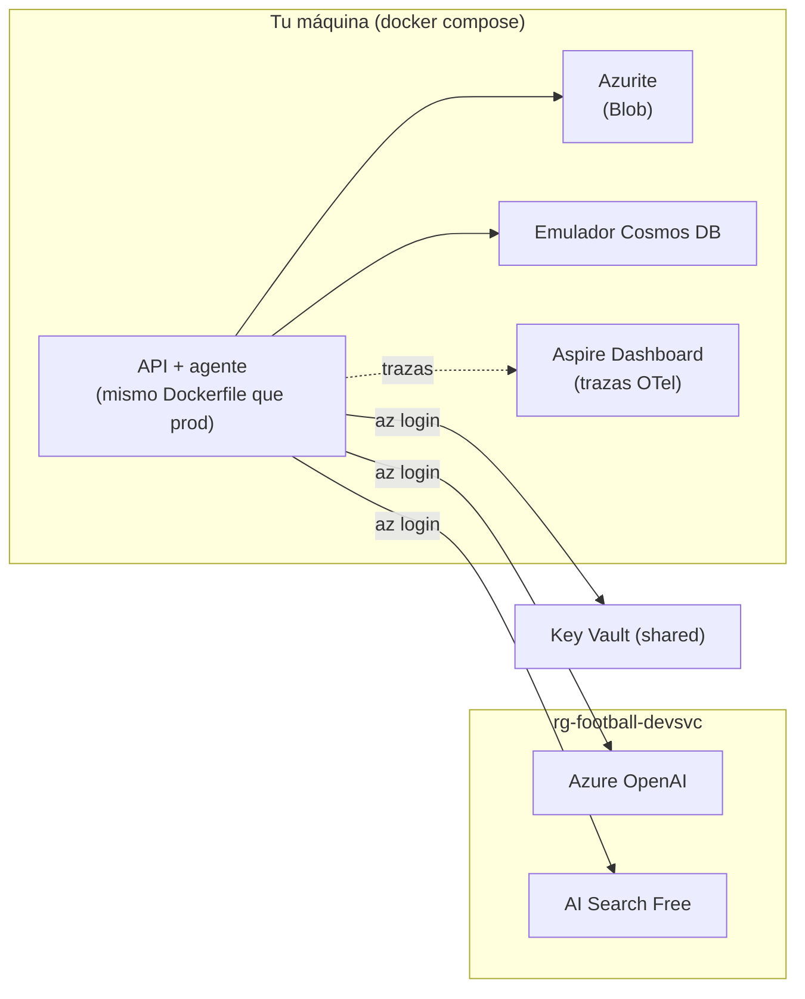
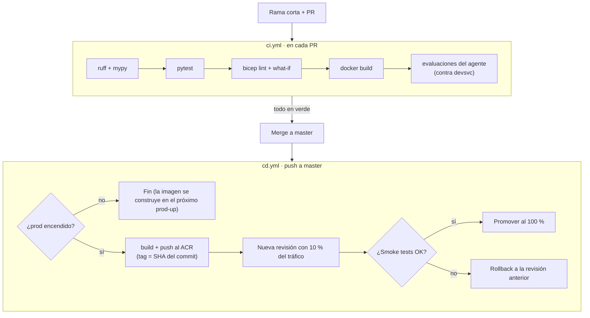
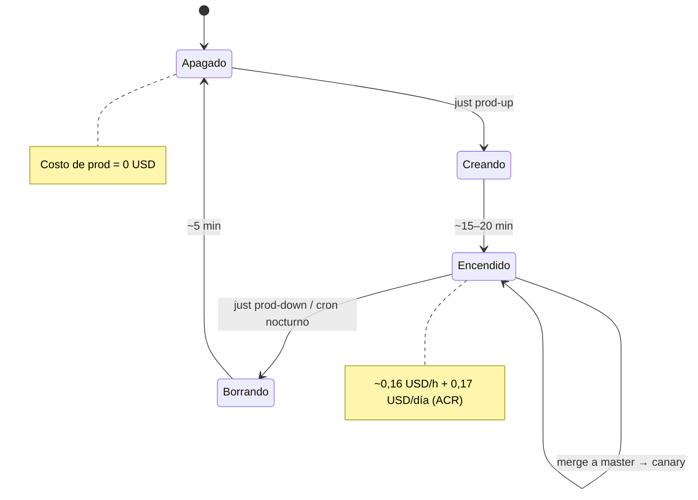

# Plan técnico: Agente de Fútbol (Versión 1, Semantic Kernel)

Plan de implementación de la **Versión 1** del agente: orquestación propia con Semantic Kernel, desplegada en Azure con prácticas de producción y un presupuesto mínimo. El contexto del proyecto está en [README.md](README.md).

---

## 1. Decisiones clave

| Tema | Decisión | Motivo |
|---|---|---|
| Lenguaje | **Python 3.12** | El ecosistema con más soporte para IA, RAG y Semantic Kernel |
| Orquestación | **Semantic Kernel** | Objetivo de aprendizaje: controlar el loop de function calling |
| Host | **Azure Container Apps** (perfil Consumption) | Escala a 0, integración con VNet, revisiones para canary y rollback |
| Ramas | Solo **`master`** (trunk-based) | Menos entornos que mantener; los cambios entran vía PR |
| Entornos | Solo **prod, efímero** | Se crea para cada sesión de práctica y se destruye al terminar (costo mínimo) |
| Pruebas antes de prod | Local + gates de CI (tests + evaluaciones del agente) | Sustituyen al entorno dev |
| Autenticación a Azure | **Managed Identity + RBAC** (`DefaultAzureCredential`) | Sin keys de Azure en código, en `.env` ni en GitHub |
| Secretos | **Key Vault** (solo la API key de football-data.org) | El único secreto que no se puede eliminar |
| IaC | **Bicep** + Azure Verified Modules | Nativo de Azure, módulos mantenidos por Microsoft |
| CI/CD | **GitHub Actions + OIDC** | Federated credentials: sin secretos de Azure en GitHub |
| Registro de imágenes | **ACR Basic efímero** (dentro de prod) | Se cobra por día que existe: solo se paga en los días de sesión |
| Red de prod | VNet + private endpoints, acceso público deshabilitado en los backends | Práctica real de producción |
| API Management | Pospuesto (fase opcional) | Tarda 30–60 minutos en crearse y no encaja con el ciclo efímero |

---

## 2. Stack tecnológico

### Aplicación
| Componente | Tecnología |
|---|---|
| Framework del agente | `semantic-kernel` |
| API HTTP | `fastapi` + `uvicorn` |
| Modelos y validación | `pydantic` v2, `pydantic-settings` |
| Cliente HTTP | `httpx` (async) |
| Resiliencia | `tenacity` (reintentos con backoff y jitter), circuit breaker propio |
| Lectura del PDF | `pypdf` |
| Streaming | Server-Sent Events (SSE) |

### SDKs de Azure
| Paquete | Uso |
|---|---|
| `azure-identity` | `DefaultAzureCredential` (tu usuario en local, Managed Identity en Azure) |
| `openai` / conector de Azure OpenAI de Semantic Kernel | Chat y embeddings |
| `azure-search-documents` | Índice y búsqueda híbrida |
| `azure-cosmos` | Historial de conversación y caché de la API |
| `azure-storage-blob` | PDF del reglamento |
| `azure-keyvault-secrets` | API key de football-data.org |
| `azure-ai-contentsafety` | Moderación y Prompt Shields |
| `azure-monitor-opentelemetry` | Trazas, métricas y logs hacia App Insights |
| `azure-ai-evaluation` | Evaluaciones del agente (groundedness, relevancia, tool routing) |

### Modelos de IA
| Uso | Modelo |
|---|---|
| Chat / razonamiento | Modelo *mini* vigente de Azure OpenAI (p. ej. `gpt-4.1-mini`), con **versión fijada** |
| Embeddings | `text-embedding-3-small` |

La disponibilidad de modelos varía por región: se valida antes de fijar la región (por defecto, `eastus`).

### Calidad y tooling
| Herramienta | Uso |
|---|---|
| `uv` | Gestión de dependencias y lockfile |
| `ruff` | Lint y formato |
| `mypy` | Tipado estático |
| `pytest`, `pytest-asyncio` | Tests |
| `hypothesis` | Property-based tests de la lógica de clasificación |
| `respx` | Mock de llamadas HTTP (tests de contrato con football-data.org) |
| `pre-commit` | Checks antes de cada commit |
| `just` | Atajos de comandos (`just test`, `just dev`, `just prod-up`…) |
| `locust` | Prueba de carga |

### Infraestructura y operación
| Componente | Tecnología |
|---|---|
| IaC | Bicep, Azure Verified Modules, `bicep lint`, `az deployment what-if` |
| CI/CD | GitHub Actions, OIDC, `gh` CLI |
| Contenedores | Docker (build multi-stage, `python:3.12-slim`) |
| Observabilidad | OpenTelemetry → Application Insights / Log Analytics |
| Local | Docker Compose: Azurite, emulador de Cosmos DB, Aspire Dashboard (visor de trazas OpenTelemetry) |

---

## 3. Arquitectura general (prod)



**Puntos clave:**
- La **API es pública** (ingress externo con autenticación Entra ID). **Los backends son privados**: solo se accede a ellos desde la VNet, vía private endpoints.
- La salida hacia football-data.org es la única llamada a internet.
- El ACR Basic no soporta private endpoints: queda público, pero sin acceso anónimo ni usuario admin, y solo la Managed Identity puede descargar imágenes.

---

## 4. Flujo de una petición



Cada paso emite spans de OpenTelemetry: latencia, tokens, tool elegida y errores.

---

## 5. Organización de recursos



| Resource group | Vida | Por qué existe |
|---|---|---|
| `rg-football-shared` | Permanente | Lo que debe sobrevivir al teardown: el secreto, la telemetría histórica y las identidades (así los permisos RBAC en Key Vault son estables) |
| `rg-football-devsvc` | Permanente | Azure OpenAI y AI Search no tienen emulador: los usan el desarrollo local y las evaluaciones de CI. No tiene cómputo, así que no cuesta nada en reposo |
| `rg-football-prod` | Efímero | Todo lo que se cobra por hora o por día. Se crea con `prod-up` y se borra con `prod-down` |

### Convención de nombres

Abreviaturas del Cloud Adoption Framework de Microsoft. Donde el nombre debe ser globalmente único, se agrega un sufijo corto (`uniqueString`).

| Recurso | Patrón | Ejemplo |
|---|---|---|
| Resource group | `rg-football-<capa>` | `rg-football-prod` |
| Container App | `ca-football-<nombre>` | `ca-football-agent` |
| Container Apps Job | `caj-football-<nombre>` | `caj-football-ingest` |
| Container Apps Environment | `cae-football-<capa>` | `cae-football-prod` |
| Container Registry | `acrfootball<capa><sufijo>` | `acrfootballprodx7k2` |
| Azure OpenAI | `oai-football-<capa>-<sufijo>` | `oai-football-prod-x7k2` |
| AI Search | `srch-football-<capa>-<sufijo>` | `srch-football-prod-x7k2` |
| Cosmos DB | `cosmos-football-<capa>-<sufijo>` | `cosmos-football-prod-x7k2` |
| Storage | `stfootball<capa><sufijo>` | `stfootballprodx7k2` |
| Key Vault | `kv-football-<sufijo>` | `kv-football-x7k2` |
| Managed Identity | `id-football-<uso>` | `id-football-app` |

**Tags en todos los recursos:** `project=football-agent`, `layer=<shared|devsvc|prod>`, `managed-by=bicep`, `ephemeral=<true|false>`.

---

## 6. Red (prod)



- **6 private endpoints:** Azure OpenAI, AI Search, Cosmos DB, Blob, Key Vault (el de `shared`) y Content Safety.
- **Private DNS zones** enlazadas a la VNet, para que los nombres públicos (`*.openai.azure.com`…) resuelvan a IPs privadas.
- **Backends de prod:** `publicNetworkAccess: Disabled`.
- **Key Vault (`shared`):** acceso público con RBAC, para poder cargar el secreto una vez desde tu máquina. Prod lo lee por su private endpoint.
- **Control plane vs. data plane:** Bicep (control plane, vía Azure Resource Manager) funciona desde GitHub Actions aunque todo sea privado. La ingesta (data plane) corre como un **job dentro de la VNet**.

---

## 7. Identidad y seguridad

| Identidad | Tipo | Roles | Alcance |
|---|---|---|---|
| `id-football-app` | User-assigned MI | Cognitive Services OpenAI User | Azure OpenAI de prod |
| | | Search Index Data Reader / Contributor (el job) | AI Search de prod |
| | | Cosmos DB Built-in Data Contributor | Cosmos DB de prod |
| | | Storage Blob Data Reader | Storage de prod |
| | | Key Vault Secrets User | Key Vault de `shared` |
| | | Cognitive Services User | Content Safety |
| | | AcrPull | ACR de prod |
| `id-football-github` | User-assigned MI + federated credential (OIDC) | Contributor + Role Based Access Control Administrator (limitado a los roles de arriba) | Suscripción (para crear y borrar `rg-football-prod`) |
| Tu usuario | Entra ID | Mismos roles de datos que la app | **Solo `devsvc`** y el Key Vault de `shared`. Sin acceso a los datos de prod |

**Otras medidas de seguridad:**
- Content Safety en entrada y salida, y Prompt Shields contra prompt injection (incluido el texto que devuelve la API externa).
- Argumentos de las tools validados con Pydantic antes de ejecutarse.
- Límites por turno: iteraciones de tools, `max_tokens` y timeout total.
- Autenticación Entra ID (JWT) en la API.
- No se loguean prompts completos en prod, solo metadatos y tokens.
- ACR sin usuario admin ni pull anónimo.

---

## 8. Desarrollo local



- `DefaultAzureCredential` usa tu `az login`: el código es el mismo que en prod.
- El `.env` solo guarda configuración no sensible (endpoints, nombres de índices, `APP_ENV=local`).
- Los tests unitarios corren **sin red** (con fakes de las tools y del LLM).

---

## 9. CI/CD



| Workflow | Cuándo corre | Qué hace |
|---|---|---|
| `ci.yml` | En cada PR | Lint, tipos, tests, Bicep (lint + what-if), build de la imagen, evaluaciones del agente |
| `cd.yml` | Push a `master` | Si prod está encendido: build + push, canary, smoke tests, promoción o rollback |
| `prod-up.yml` | Manual | Infraestructura de prod (Bicep) → ACR → build + push → Container App → ingesta → smoke tests |
| `prod-down.yml` | Manual **y cada noche** (cron) | Borra `rg-football-prod` y purga los recursos con soft-delete |

**Protección de `master`:** sin push directo, solo PRs con CI en verde.

---

## 10. Ciclo de vida de una sesión de práctica



```
just prod-up        # gh workflow run prod-up.yml + gh run watch
just prod-status    # az group exists --name rg-football-prod
just prod-down      # gh workflow run prod-down.yml + gh run watch
```

---

## 11. Estructura del repositorio

```
football-agent-project/
├── src/football_agent/
│   ├── tools/                  # Lógica pura de cada tool (no conoce Semantic Kernel)
│   │   ├── standings_calc.py   # Cálculos de clasificación
│   │   ├── football_api.py     # Cliente de football-data.org
│   │   └── rules_search.py     # Búsqueda en el reglamento
│   ├── plugins/                # Wrappers @kernel_function sobre tools/
│   ├── agent/                  # Kernel, system prompt, loop, límites
│   ├── api/                    # FastAPI: rutas, auth, streaming
│   ├── infra/                  # Adaptadores: Cosmos DB, Key Vault, Content Safety, caché
│   ├── telemetry.py            # Configuración de OpenTelemetry
│   └── config.py               # Settings (pydantic-settings)
├── ingestion/                  # Job: PDF → chunks → embeddings → AI Search
├── evals/                      # Dataset de evaluación y runners
├── tests/
│   ├── unit/
│   ├── contract/               # Respuestas grabadas de football-data.org
│   └── smoke/                  # Tests contra el despliegue
├── infra/
│   ├── modules/                # Módulos Bicep reutilizables
│   ├── shared/main.bicep
│   ├── devsvc/main.bicep
│   └── prod/main.bicep
├── .github/workflows/          # ci, cd, prod-up, prod-down
├── docs/adr/                   # Architecture Decision Records
├── docker-compose.yml
├── Dockerfile
├── justfile
├── pyproject.toml
└── uv.lock
```

La lógica de las tools (`tools/`) no depende de Semantic Kernel, así que en la Versión 2 (Foundry Agent Service) se reutiliza sin cambios.

---

## 12. Fases

### Fase 0: fundamentos
- `git init`, repositorio en GitHub y protección de `master`.
- Estructura de carpetas, `pyproject.toml` con `uv`, ruff, mypy, pytest y pre-commit.
- `justfile` con los comandos base.
- ADRs iniciales (ver sección 15).
- **Listo cuando:** `just check` (lint + tipos + tests) pasa en local y en un primer `ci.yml`.

### Fase 1: walking skeleton
- **Bootstrap (una sola vez, a mano):** desplegar `shared` y `devsvc` con tu usuario, crear la federated credential de GitHub y cargar la API key en Key Vault. Es inevitable: la identidad de CI no puede crearse a sí misma.
- Bicep de `prod` mínimo: Container Apps + ACR + Azure OpenAI (todavía sin red privada).
- Agente de Semantic Kernel **sin tools** detrás de FastAPI (`/chat`, `/health/live`, `/health/ready`).
- `Dockerfile`, `docker-compose.yml` y OpenTelemetry desde el primer commit.
- Workflows `ci`, `cd`, `prod-up` y `prod-down` (incluido el cron nocturno).
- Budget con alertas.
- **Listo cuando:** `just prod-up` deja un agente vivo en Azure con trazas en App Insights, y `just prod-down` lo borra por completo, sin secretos en el código ni en GitHub.

### Fase 2: tool de cálculo
- Puntos máximos posibles, ¿puede todavía clasificar?, diferencia de goles necesaria.
- Tests unitarios y property-based.
- Plugin de Semantic Kernel y primer dataset de evaluación.
- **Listo cuando:** el agente elige la tool correctamente en el dataset y los tests están en verde.

### Fase 3: tool de football-data.org
- Cliente async con timeouts, reintentos, circuit breaker y respeto de `429` y `Retry-After`.
- Caché con TTL en Cosmos DB (tabla ~5 min, partidos terminados ~24 h).
- Modelos Pydantic normalizados (no se pasa el JSON crudo al LLM).
- Degradación elegante cuando la API no responde.
- Tests de contrato con respuestas grabadas.
- **Listo cuando:** el agente responde preguntas combinadas (API + cálculo) y sobrevive a una API caída.

### Fase 4: RAG del reglamento
- Job de ingesta: PDF de Blob → chunking por regla o sección → embeddings → índice.
- Índice versionado (`rules-v1`, `rules-v2`…) detrás de un alias.
- Búsqueda híbrida + semantic ranker.
- Evaluación de retrieval (¿el fragmento correcto está en el top-3?) y de groundedness.
- **Listo cuando:** `prod-up` indexa el reglamento automáticamente y las evaluaciones superan el umbral.

### Fase 5: agente endurecido
- Loop manual (`auto_invoke=False`) para aprender, y luego `FunctionChoiceBehavior.Auto()`.
- Límites de iteraciones, tokens y tiempo; truncado del historial.
- Historial en Cosmos DB, Content Safety, Prompt Shields y streaming SSE.
- Evaluaciones como **gate obligatorio** de CI.
- **Listo cuando:** un PR que empeora el tool routing queda bloqueado por CI.

### Fase 6: red privada y autenticación
- VNet, subnets, private endpoints, private DNS zones y `publicNetworkAccess: Disabled`.
- Autenticación Entra ID en la API.
- **Listo cuando:** los backends de prod no responden desde internet y el agente funciona igual.

### Fase 7: operación
- Dashboards: latencia p50/p95, tokens y costo por request, uso de cada tool, errores y fallbacks.
- Alertas: 5xx, latencia, circuit breaker abierto, cuota de Azure OpenAI y budget.
- Canary con rollback automático.
- Prueba de carga con Locust.
- Runbook de incidentes.
- **Listo cuando:** un despliegue defectuoso se revierte solo y la alerta llega por correo.

### Fase 8 (opcional): APIM como AI gateway
Límite de tokens por consumidor, métricas de tokens y caché semántico.

**Después:** migración a Azure AI Foundry Agent Service (Versión 2) y comparación final.

---

## 13. Costos estimados

Valores aproximados (USD, `eastus`, pago por uso). Verificar en la [Azure Pricing Calculator](https://azure.microsoft.com/pricing/calculator/).

| Concepto | Tipo de cobro | Costo |
|---|---|---|
| `shared` (Key Vault, Log Analytics dentro de 5 GB gratis, identidades) | Por uso | Céntimos al mes |
| `devsvc` (Azure OpenAI + AI Search Free) | Por uso (tokens) | ~1–3 USD/mes |
| Prod: AI Search Basic | Por hora | ~0,10 USD/h |
| Prod: 6 private endpoints | Por hora | ~0,06 USD/h |
| Prod: ACR Basic | Por día | ~0,17 USD/día |
| Prod: Container Apps | Tiempo activo (cuota gratuita mensual) | ~0 USD |
| Prod: Cosmos DB serverless, Storage, Content Safety F0 | Por uso | ~0 USD |
| **Sesión de prod de 4 horas** | | **~0,80 USD** |
| **Total mensual (≈4 sesiones)** | | **~5–7 USD** |

**Controles:** budget con alertas al 50/80/100 %, límite diario en Log Analytics, `max_tokens` y límite de iteraciones, teardown nocturno automático.

---

## 14. Riesgos y mitigaciones

| Riesgo | Mitigación |
|---|---|
| Olvidar apagar prod | Cron nocturno de `prod-down` + alerta de budget |
| Soft-delete bloquea recrear recursos con el mismo nombre | `prod-down` purga Azure OpenAI y Content Safety; Key Vault vive en `shared` y nunca se borra |
| Sin entorno dev, un bug llega a prod | Gates de CI (tests + evaluaciones), canary al 10 %, smoke tests, rollback automático |
| Límite de 10 req/min de football-data.org | Caché con TTL + backoff ante `429` |
| Cuota de Azure OpenAI insuficiente en la región | Validar la cuota antes de fijar la región; manejar `429` con reintentos |
| El LLM elige mal la tool | Descripciones claras de las tools + dataset de evaluación en CI |
| Prompt injection desde la API externa | Prompt Shields sobre los resultados de las tools |
| Se pierde el historial de conversación con cada `prod-down` | Aceptado: es un proyecto de práctica. La telemetría sí persiste en `shared` |
| Cold start al escalar desde 0 | Imagen pequeña; `minReplicas: 1` durante una sesión si hace falta |

---

## 15. ADRs a escribir

1. Python + Semantic Kernel para la Versión 1.
2. Azure Container Apps en lugar de Azure Functions.
3. Un solo entorno efímero (prod) con trunk-based development.
4. Capas de resource groups: `shared`, `devsvc` y `prod`.
5. ACR Basic efímero frente a permanente.
6. Cosmos DB como historial y caché (en lugar de Redis).
7. AI Search Free en `devsvc` y Basic en prod.
8. APIM pospuesto.
